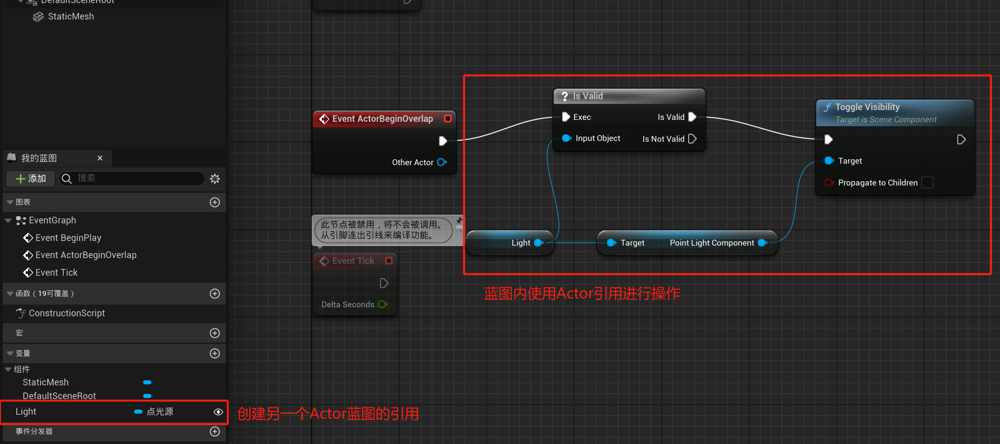
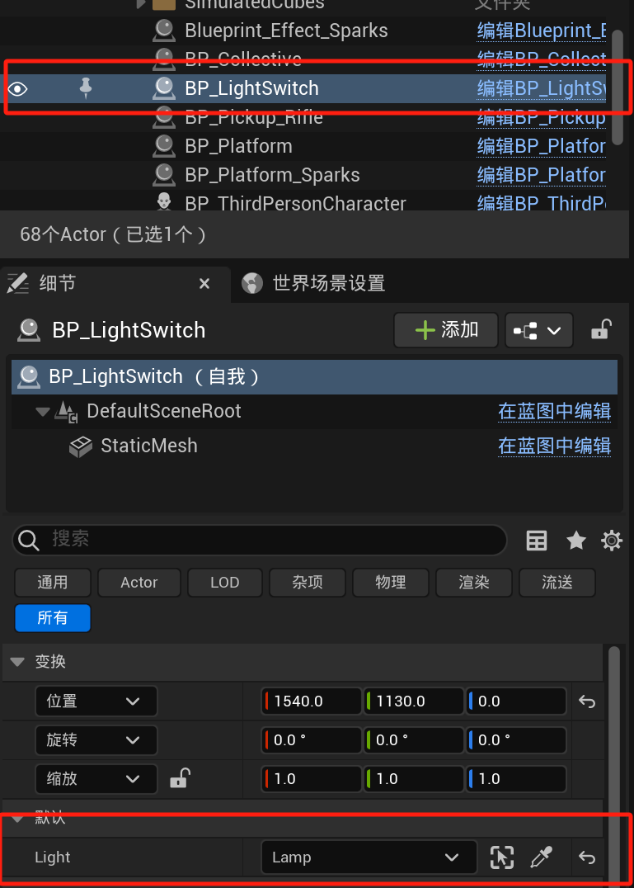
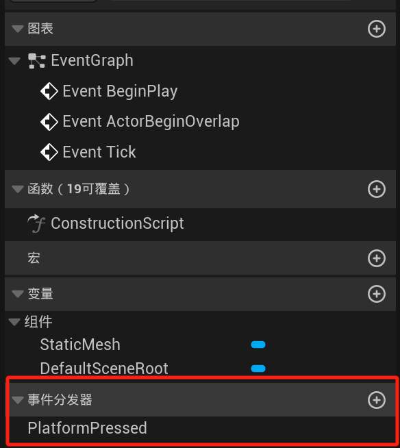
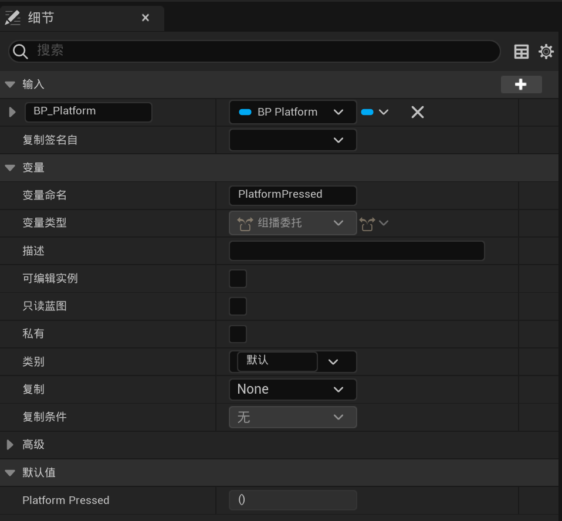
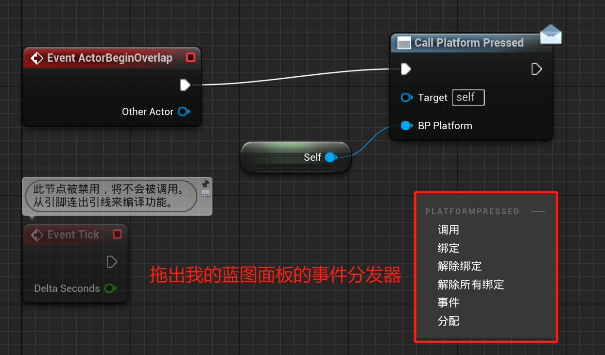
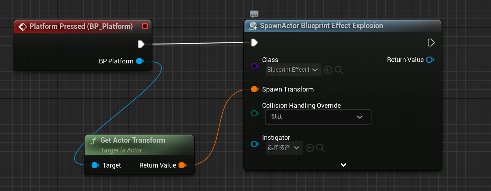
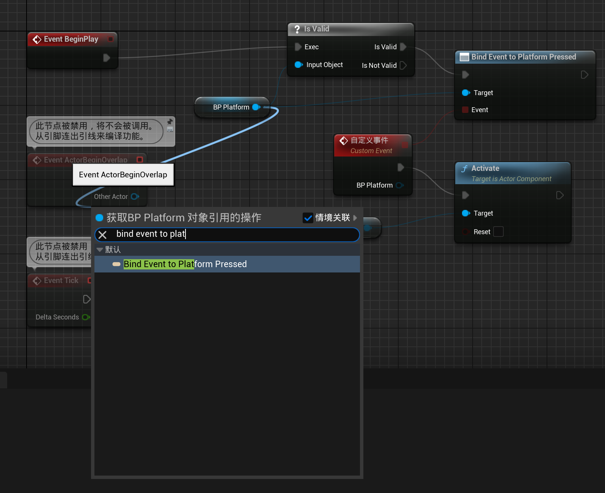

# Blueprint_communication

# Blueprint_communication

## 直接蓝图通信
 
在蓝图内创建另一个Actor和蓝图的引用，直接在蓝图内通过引用操作该Actor和蓝图。 

 
在关卡蓝图内放置Actor后选中该Actor，设置引用变量的对象。 

### 何时使用
- 关卡中存在两个 Actors，需要进行相互之间的通信

## 事件分发器（告知其他正在监听的蓝图已发生事件）
 
事件分发器创建 

 
可以在细节面板设置事件分发器输入 

 
事件分发器调用：右键输入Call 事件分发器名 或直接在我的蓝图面板拖出事件分发器，现在调用 

 
事件分发器使用：确保事件分发器所在的蓝图类在关卡中处于选中状态，打开管卡蓝图右键输入add 事件分发器名即可 

 
绑定事件：将一个事件绑定到另一个事件分发器或事件上。通过事件分发器所在蓝图实例绑定

### 何时使用
- 需要从角色蓝图到关卡蓝图进行通信。
    - 玩家角色升级，需要开放之前锁定的区域。
    - 玩家角色按下行动按钮，对关卡执行某种操作。
- 生成的 Actor 执行某种操作时触发事件。
    - 生成一个 Boss，Boss 被消灭时触发事件，在世界场景中生成一个奖励。
    - 在关卡中生成一个道具（武器、回复剂等）并在道具被拾起时告知道具和角色。

## 蓝图接口

